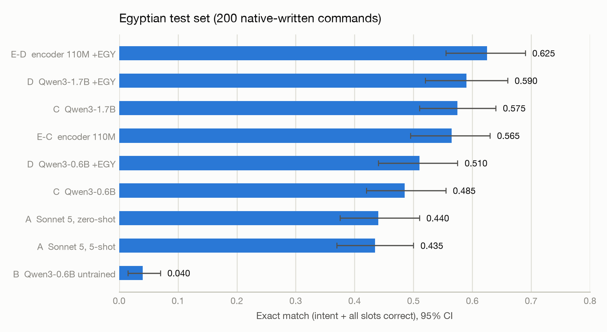
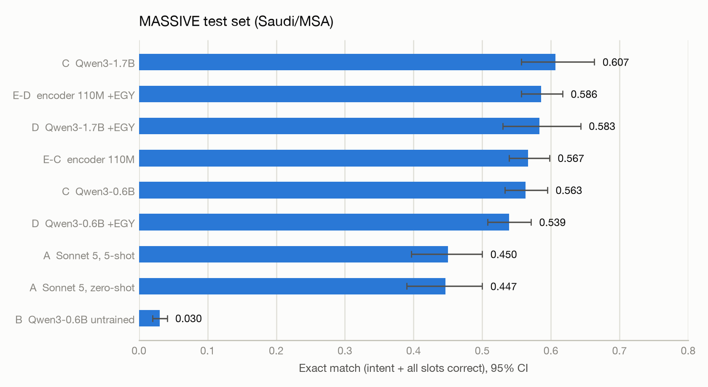
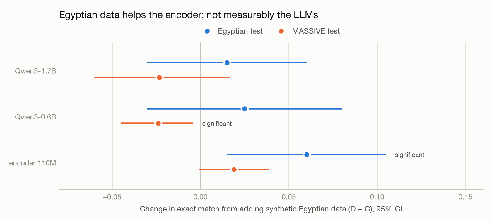
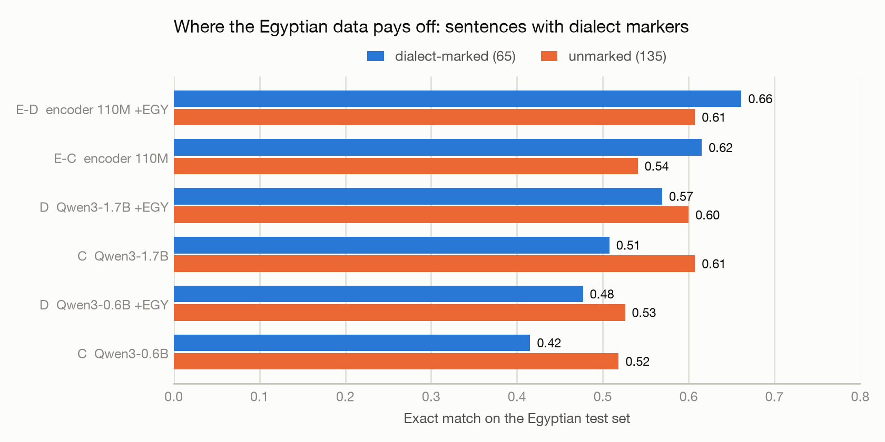
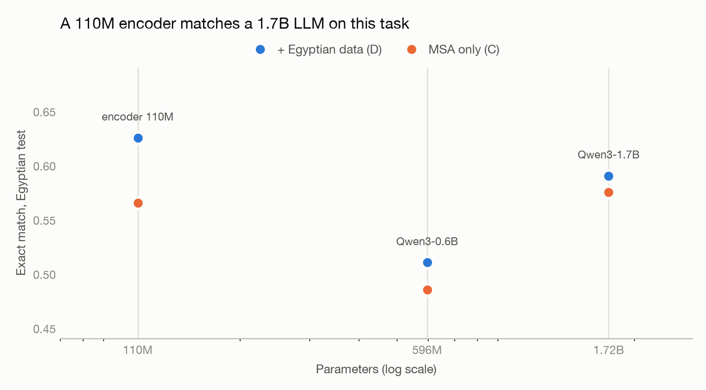
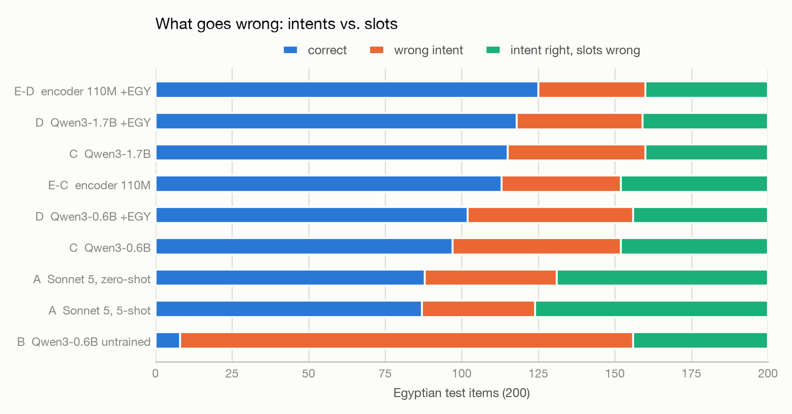

# Egyptian Arabic voice-assistant NLU — results

**Question.** Arabic assistant training data is Modern Standard and Gulf Arabic, but Egyptians
speak Egyptian. Does *synthetic* dialect data — generated by an LLM, filtered by rules — close
that gap, and what does it cost on the original variety?

**Setup.** One task: turn an Arabic voice command into a tool call (intent + slots), scored by
exact match. Two training mixes, held to an identical optimizer budget:

- **C** — MASSIVE `ar-SA` only (Saudi/MSA), 11,514 examples
- **D** — the same, plus 6,509 filtered Egyptian rewrites, 18,023 examples

Each mix was trained on three backbones (110M encoder, Qwen3-0.6B, Qwen3-1.7B) and compared
against a frontier LLM (Claude Sonnet 5, zero-shot **and** 5-shot) and an untrained 5-shot baseline.

**Five findings:**

1. Synthetic Egyptian data gives the **encoder a significant +6.0 points** on Egyptian, with no
   loss on MSA — but gives the **LLMs nothing measurable** at either size.
2. A **110M encoder matches a 1.7B LLM** (0.625 vs 0.590, n.s.) at **43× lower latency**, and
   beats the *quantized* 1.7B outright (+7.0 pts, significant) — so shrinking the LLM enough to
   ship it on a phone hands the win to the encoder.
3. The frontier model's deficit is almost entirely **annotation conventions**, not comprehension.
4. **Showing it five examples does not fix that** (0.440 → 0.435, n.s.). Conventions here are
   learned from thousands of labelled examples, not demonstrated in a prompt.
5. **4-bit quantization has no net cost on MSA but costs ~4 points on the Egyptian set** (p = 0.10)
   while cutting the 1.7B's size 3.4× and latency 2.6×. It changes ~22% of outputs on both sets.
   Only on Egyptian do the changes lean negative, mostly as intent errors, and evenly across
   dialect-marked and unmarked sentences.

---

## 1. Evaluation

| Test set | n | What it measures |
|---|---:|---|
| **Egyptian test** | 200 | Commands written by a native Egyptian speaker, from MASSIVE *test* items |
| **MASSIVE test** | 300–1000 | Held-out Saudi/MSA — checks nothing was lost |

**Exact match** = intent correct *and* every slot correct (type and value), after light Arabic
normalization (diacritics, alef/ya forms, Arabic-Indic digits). Intervals are bootstrap 95% CIs;
model-to-model comparisons use a **paired** bootstrap on the same items, which is far more
sensitive than comparing two independent intervals.

**Leakage control.** 19 of the 200 Egyptian test sentences also appear verbatim in training data —
short commands like "امسح المنبه" that any two writers phrase identically. Every table reports
`EM clean`, which excludes them. Rankings are unchanged; absolute scores drop 2–3 points.

## 2. Headline results



| Model | Params | Intent acc | Slot F1 | Exact match | 95% CI | EM clean | p50 latency |
|---|---:|---:|---:|---:|---:|---:|---:|
| **E-D** encoder + Egyptian | 110M | 0.825 | 0.665 | **0.625** | [0.56, 0.69] | 0.608 | 8 ms |
| **D** Qwen3-1.7B + Egyptian | 1.7B | 0.795 | 0.682 | **0.590** | [0.52, 0.66] | 0.569 | — |
| ↳ same, MLX fp16 | 1.7B | 0.795 | 0.688 | 0.595 | [0.53, 0.67] | 0.575 | 881 ms |
| ↳ same, MLX 4-bit | 1.7B | 0.760 | 0.655 | 0.555 | [0.48, 0.62] | 0.530 | 345 ms |
| **C** Qwen3-1.7B, MSA only | 1.7B | 0.775 | 0.649 | 0.575 | [0.51, 0.64] | 0.547 | — |
| **E-C** encoder, MSA only | 110M | 0.805 | 0.628 | 0.565 | [0.49, 0.63] | 0.541 | 8 ms |
| **D** Qwen3-0.6B + Egyptian | 596M | 0.730 | 0.599 | 0.510 | [0.44, 0.57] | 0.492 | 550 ms † |
| **C** Qwen3-0.6B, MSA only | 596M | 0.725 | 0.588 | 0.485 | [0.42, 0.56] | 0.453 | 550 ms † |
| **A** Sonnet 5, zero-shot | — | 0.785 | 0.503 | 0.440 | [0.38, 0.51] | 0.420 | API |
| **A** Sonnet 5, 5-shot | — | 0.815 | 0.500 | 0.435 | [0.37, 0.50] | 0.409 | API |
| **B** Qwen3-0.6B untrained, 5-shot | 596M | 0.260 | 0.100 | 0.040 | [0.01, 0.07] | 0.039 | 1,060 ms † |

Every model emitted **valid JSON on 100%** of items; no constrained decoding was used.
Latency is the dedicated benchmark's p50 on an M4 (§4), except † rows, which were timed during
evaluation (warm-up included, so slightly pessimistic). The GPU run has none because it wasn't run
on the same machine. The ↳ rows are the same fine-tuned weights, converted for on-device use.



| Model | Intent acc | Slot F1 | Exact match | 95% CI | EM clean |
|---|---:|---:|---:|---:|---:|
| **C** Qwen3-1.7B, MSA only | 0.857 | 0.707 | **0.607** | [0.56, 0.66] | 0.581 |
| **E-D** encoder + Egyptian | 0.835 | 0.684 | 0.586 | [0.56, 0.62] | 0.564 |
| **D** Qwen3-1.7B + Egyptian | 0.840 | 0.697 | 0.583 | [0.53, 0.64] | 0.559 |
| ↳ same, MLX fp16 | 0.837 | 0.686 | 0.577 | [0.52, 0.64] | 0.551 |
| ↳ same, MLX 4-bit | 0.840 | 0.697 | 0.577 | [0.52, 0.63] | 0.555 |
| **E-C** encoder, MSA only | 0.829 | 0.665 | 0.567 | [0.54, 0.60] | 0.542 |
| **C** Qwen3-0.6B, MSA only | 0.791 | 0.678 | 0.563 | [0.53, 0.59] | 0.538 |
| **D** Qwen3-0.6B + Egyptian | 0.783 | 0.652 | 0.539 | [0.51, 0.57] | 0.512 |
| **A** Sonnet 5, 5-shot | 0.813 | 0.569 | 0.450 | [0.40, 0.50] | 0.434 |
| **A** Sonnet 5, zero-shot | 0.807 | 0.554 | 0.447 | [0.39, 0.50] | 0.430 |
| **B** Qwen3-0.6B untrained | 0.310 | 0.122 | 0.030 | [0.02, 0.04] | 0.024 |

The 4-bit build's slightly higher intent accuracy and slot F1 here are noise, not a quantization
gain: intent differs by one item in 300, and exact match is tied, with 11 items won and 11 lost
(§4).

## 3. Does the synthetic Egyptian data help?



| Backbone | Egyptian test | MASSIVE test |
|---|---|---|
| **Encoder 110M** | **+6.0 pts** [+1.5, +10.5] — significant | +1.9 pts [−0.1, +3.9] — n.s. |
| Qwen3-0.6B | +2.5 pts [−3.0, +8.0] — n.s. | **−2.4 pts** [−4.5, −0.4] — significant |
| Qwen3-1.7B | +1.5 pts [−3.0, +6.0] — n.s. | −2.3 pts [−6.0, +1.7] — n.s. |

The split is consistent and replicates across a 3× change in model size: **the data helps the
model that lacks dialect knowledge and does nothing for the models that already have it.**
Qwen3 is pretrained on 100+ languages and dialects, and C-1.7B — which never saw a word of
Egyptian in fine-tuning — already beats the dialect-trained encoder's MSA-only variant on the
Egyptian set (0.575 vs 0.565).

The mechanism is still visible in where the gains land:



| Model | Dialect-marked (65) | Unmarked (135) | Gain where it matters |
|---|---:|---:|---|
| C → D, Qwen3-0.6B | 0.415 → 0.477 | 0.519 → 0.526 | **+6.2** vs +0.7 |
| C → D, Qwen3-1.7B | 0.508 → 0.569 | 0.607 → 0.600 | **+6.1** vs −0.7 |
| E-C → E-D, encoder | 0.615 → 0.662 | 0.541 → 0.607 | +4.7 vs +6.6 |

On sentences containing Egyptian function words (عايز، ازاي، دلوقتي…), the Egyptian data is worth
about **+6 points to both LLMs**. The aggregate washes out because two thirds of natural Egyptian
commands carry no such marker — they are lexically close to MSA.

## 4. Size, architecture and cost



Scaling the LLM from 0.6B to 1.7B is worth **+8.0 points** on Egyptian [+2.0, +14.5] and +4.9 on
MASSIVE — both significant, and both larger than anything the data mix achieved. But the 110M
encoder still edges the 1.7B LLM — +3.5 points against the fp16 build (n.s.) and +7.0 against the
4-bit build (significant) — at **8 ms versus 345–881 ms** per command and 15× fewer parameters.

For a fixed schema, tagging spans beats generating them: the encoder cannot invent a slot value,
while the LLM must reproduce it character-for-character.

### Measured latency and size

All on one 16GB M4, 50 commands each, issued one at a time, warm-up discarded
(`python -m lahja.eval.bench`). Each model runs on the runtime it would actually deploy with, so
this is a deployment comparison, not a pure-architecture one.

| Model | Runtime | Weights on disk | p50 | p90 | p95 |
|---|---|---:|---:|---:|---:|
| CAMeLBERT 110M encoder | PyTorch / MPS | 417 MB | **8 ms** | 16 ms | 17 ms |
| Qwen3-1.7B + LoRA, 4-bit | MLX | 948 MB | **345 ms** | 430 ms | 485 ms |
| Qwen3-1.7B + LoRA, fp16 | MLX | 3.2 GB | **881 ms** | 1,238 ms | 1,260 ms |

Two things fall out. **4-bit quantization buys 2.6× lower latency and 3.4× less disk** than fp16 —
the difference between a model that fits comfortably on a phone and one that does not. And the
110M encoder is still **43× faster than the quantized 1.7B**, at a quarter of its size, while
scoring at least as well on the Egyptian test set.

### What 4-bit costs in accuracy

The MLX fp16 build is the control: same weights as the GPU run, different runtime. It reproduces
that run to within one or two items, so the port itself is faithful and any remaining difference
is the quantization.

| Build | Egyptian test | MASSIVE test | Disk | p50 |
|---|---:|---:|---:|---:|
| GPU (transformers, bf16) | 0.590 | 0.583 | — | — |
| MLX fp16 | **0.595** | 0.577 | 3.2 GB | 881 ms |
| MLX 4-bit | **0.555** | 0.577 | 948 MB | 345 ms |

| Paired comparison | Egyptian test | MASSIVE test |
|---|---|---|
| MLX fp16 − GPU (runtime fidelity) | +0.5 pts, 1 item differs | −0.7 pts, 2 items differ |
| **4-bit − fp16 (quantization cost)** | **−4.0 pts** [−8.0, 0.0], n.s. (p = 0.10) | **0.0 pts** [−3.3, +3.3] |

**Quantization has no net cost on MSA and may cost something on the dialect.** 4-bit rounding
changes a similar share of outputs on both sets: 65 of 300 on MASSIVE (22%) and 45 of 200 on
Egyptian (22.5%). On MASSIVE those changes cancel out: 11 items become exact matches and 11 stop
being exact matches, so the score is identical and the small intent and slot-F1 differences are
noise. On Egyptian they don't cancel: 13 items lost against 5 gained, −4 points. With only 18
items changing, a 13–5 split misses significance (p = 0.10), so this may still be chance.

It is **not** a dialect effect, though that was the obvious guess. Within the Egyptian set the loss
is spread evenly: −3.1 points on dialect-marked sentences and −4.4 on unmarked ones. It is almost
entirely **intent** errors (48 wrong intents against 41, while slot-only errors move 40 → 41).
Because quantization shifts outputs equally often on both sets, "MSA is robust to rounding" is not
the explanation either. The only open question is whether the changes on Egyptian lean negative
for a real reason, and 200 items are too few to answer it.

The practical read: **4-bit is the right trade for MSA, and needs a bigger test set before you
trust it for Egyptian.** It also flips the headline comparison — against the shippable 4-bit build,
the 110M encoder's Egyptian advantage becomes significant (+7.0 pts [+1.5, +12.5]).

## 5. Error analysis



| Model | Correct | Wrong intent | Intent right, slots wrong |
|---|---:|---:|---:|
| E-D encoder + Egyptian | 125 | 35 | 40 |
| D Qwen3-1.7B + Egyptian | 118 | 41 | 41 |
| ↳ same, MLX 4-bit | 111 | **48** | 41 |
| C Qwen3-1.7B | 115 | 45 | 40 |
| E-C encoder | 113 | 39 | 48 |
| D Qwen3-0.6B + Egyptian | 102 | 54 | 44 |
| C Qwen3-0.6B | 97 | 55 | 48 |
| A Sonnet 5, zero-shot | 88 | 43 | **69** |
| A Sonnet 5, 5-shot | 87 | 37 | **76** |
| B untrained, 5-shot | 8 | 148 | 44 |

**Sonnet 5 understands the Arabic; it doesn't know the label conventions.** Its intent accuracy
(0.785) is near the encoder's (0.825), but its slot recall is 0.419. Of 127 items with slots:
38 exact, 34 where it predicted no slots at all, 37 with different slot types, 13 with the right
types but different spans. The span disagreements are conventions, not errors:

| Command | Gold (MASSIVE convention) | Sonnet 5 |
|---|---|---|
| عندي أي منبهات لستة الصبح بكره | `time: لستة الصبح` (keeps the ل) | `time: ستة الصبح` |
| اعمل منبه يصحيني سبعة الصبح يوم الخميس | `date: الخميس` | `date: يوم الخميس` |
| زواج أحمد | `event_name: زواج` + `person: أحمد` | `event_name: زواج أحمد` |

Most readers would call the model's version defensible. It is scored wrong because the benchmark
encodes an arbitrary convention — one learnable only from labelled data.

**Five examples don't teach it.** Giving Sonnet 5 the same five demonstrations model B received
(three of which contain exactly these conventions) moved exact match **0.440 → 0.435 on Egyptian
and 0.447 → 0.450 on MSA — neither significant**, and it produced *identical* predictions on all
three probe sentences above. What did change is the shape of the errors:

| Slot behaviour on the 200 Egyptian items | Zero-shot | 5-shot |
|---|---:|---:|
| Exact slot match | 38 | 44 |
| Missed all slots | 34 | **15** |
| Invented slots where gold had none | 5 | **20** |
| Right types, different spans | 13 | 19 |
| Different slot types | 37 | 44 |

Intent accuracy rose (0.785 → 0.815) and the model became far more willing to emit slots, but the
spans it emits are no closer to the convention: errors simply moved from omission to commission.
A fine-tuned 1.7B beats the 5-shot frontier model by **+15.5 points** [+8.5, +22.5] and the 110M
encoder by **+19.0** [+12.5, +26.0], both significant.

This is the clearest argument in the project for fine-tuning over prompting on schema-bound tasks:
the gap is not knowledge the model lacks, it is a labelling convention that only supervision at
scale transfers.

**By scenario** (Egyptian test, best encoder vs best LLM): both are strong on `audio` (0.94 / 0.88)
and `alarm` (0.92 / 0.83), and both are weak on `music` (0.25 / 0.17) and `play` (0.40 / 0.47),
where slot values are song, artist and playlist names that must be copied exactly.

## 6. The synthetic data

4,001 MASSIVE seeds → 2 rewrites each → 8,002 candidates → **7,239 kept** after rule-based
filtering (no LLM judge):

| Rejected because | Count |
|---|---:|
| Too close to the seed (not really rewritten) | 428 |
| Exact duplicate | 220 |
| Near duplicate | 60 |
| Slot types changed | 55 |

**The generated style is not the natural one.** Egyptian marker words appear in 60% of generated
sentences but only 32% of the human test set (2.8% in the MASSIVE seeds); English code-switching
appears in 27% versus 10%. The generator writes "more Egyptian" than Egyptians do, which is the
most likely reason transfer to the LLMs was limited, and an argument for validating generated
data against a native-written sample before training on it.

## 7. Limitations

- **200 test items** gives roughly ±7 points of interval; only differences above that are
  detectable unpaired. Paired tests are used wherever possible.
- **The frontier reference is prompt-only.** Both A runs use the same schema prompt the fine-tuned
  models were trained with; the 5-shot variant adds the same five examples model B received. A
  prompt engineered specifically for MASSIVE's conventions — spelling out clitic handling and span
  boundaries — would likely do better, and was not attempted. A is a prompting baseline, not a
  ceiling on what Sonnet 5 can do.
- **The encoders were trained for only 4 epochs** and validation was still improving, so the
  strongest row in the table is probably underestimated.
- **MASSIVE rows for the 1.7B models and A use n=300**, not 1000, so their intervals are wider.
- Generation and the human test set both derive from MASSIVE, so its domain (smart-speaker
  commands) bounds all conclusions.
- **Quantization was measured on one model** (the 1.7B) at one setting (4-bit, default group
  size). 8-bit, other group sizes, and the 0.6B were not tried.
- **Latency is from one machine** (16GB M4) with each model on its native runtime — PyTorch/MPS for
  the encoder, MLX for the LLMs — so ratios mix architecture and framework effects. It is not a
  phone measurement; production on-device deployment would go through Core ML.

## 8. Reproducing

```bash
make setup && make download && make data     # MASSIVE -> data/processed
make pilot && make submit && make collect    # generate Egyptian rewrites (Claude, batch)
make synth && make sft                       # filter -> data/sft/{C,D}
make train-mlx-D && make train-enc-D         # train (docs/training-apple-silicon.md, docs/training-gpu.md)
make eval-mlx-D && make eval-enc-D
make report && make figures                  # -> results/summary.md, results/figures/
```

On-device builds and latency (Apple silicon):

```bash
# merge the PEFT adapter into Qwen3-1.7B, then convert (fp16) and quantize (4-bit) for MLX
python -m mlx_lm convert --hf-path models/D-qwen3-17b-merged --mlx-path models/D-qwen3-17b-mlx
python -m mlx_lm convert --hf-path models/D-qwen3-17b-merged -q --q-bits 4 \
    --mlx-path models/D-qwen3-17b-mlx-4bit
python -m lahja.eval.bench --backend mlx --model models/D-qwen3-17b-mlx-4bit --prompt sft --name D-17b-4bit
make bench-encoder
```

transformers ≥ 5 saves `rope_theta` inside `rope_parameters`; mlx-lm expects it at the top level
of `config.json`, so hoist it there before converting a model merged with a recent transformers.

Model A's evaluation ran through the Batches API for **$0.49**. All evaluation goes through one
code path (`lahja.eval.run_eval`), so encoder, local LLM, and API predictions are scored by
identical metric code.
